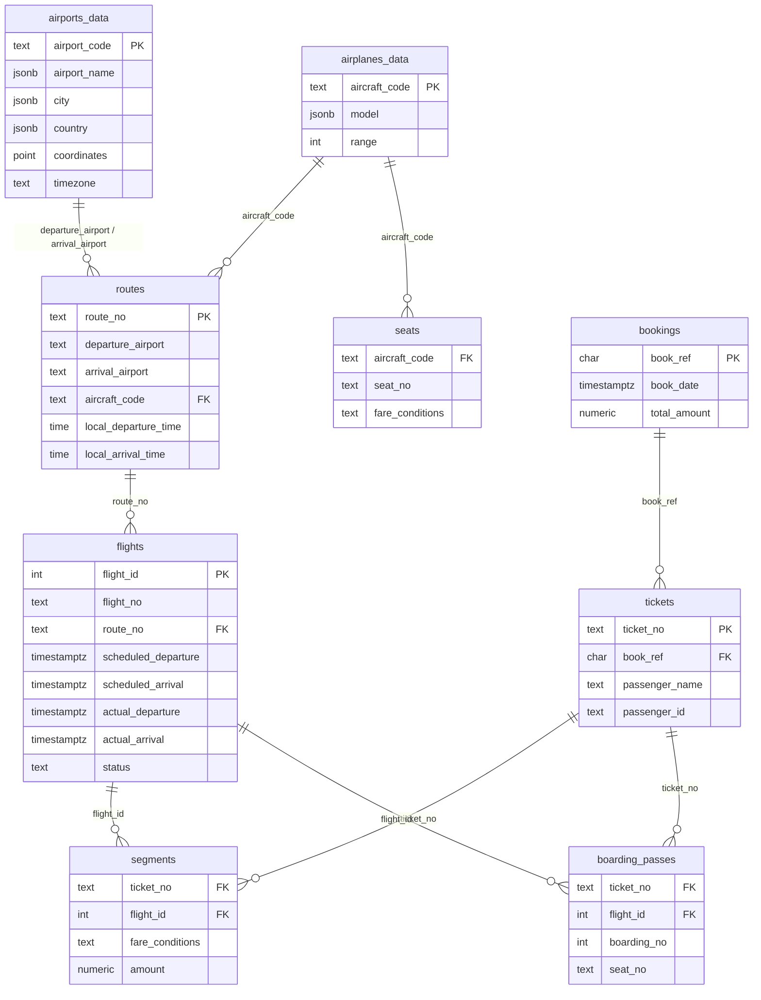

# Bookings

Pet-проект на Go + PostgreSQL: API для работы с бронированиями.

## Requirements

- Go 1.22+
- Docker (PostgreSQL)
- GNU Make (опционально; на Windows — [GnuWin32 Make](https://gnuwin32.sourceforge.net/packages/make.htm))

## Quick start

```bash
# 1. PostgreSQL
docker compose up -d

# 2. Локальный конфиг (не коммитится)
cp .env.example .env   # Windows: copy .env.example .env

# 3. Запуск API
make run
```

При старте `cmd/api` подгружает `.env` через `godotenv` (только dev-удобство), затем читает переменные окружения в typed `config.Config` через `envconfig`.

## Run

Точка входа — `cmd/api`:

```bash
make run
# или
go run ./cmd/api
```

Сборка и запуск бинарника:

```bash
make build
./bin/api          # macOS / Linux
.\bin\api.exe      # Windows
```

Проверка компиляции:

```bash
go build ./...
```

Без валидного конфига (например, пустой `DB_HOST`) приложение завершится с `exit 1`.

## Configuration

Конфигурация — [12-factor](https://12factor.net/config): значения приходят из **environment variables**, не из кода.

| Файл / механизм | Назначение |
|---|---|
| `.env.example` | шаблон переменных (в git) |
| `.env` | локальные значения (в `.gitignore`) |
| `godotenv.Load()` | dev: читает `.env` → `os.Environ` |
| `config.Load()` | читает `os.Environ` → `Config` struct |

Переменные:

| Env | Описание | Default |
|---|---|---|
| `HTTP_PORT` | порт HTTP API | `8080` |
| `DB_HOST` | хост PostgreSQL | — (required) |
| `DB_PORT` | порт PostgreSQL | `5432` |
| `DB_USER` | пользователь БД | — |
| `DB_PASSWORD` | пароль БД | — |
| `DB_NAME` | имя базы | — |
| `DB_SSLMODE` | SSL mode для pgx | `disable` |

**macOS / Linux** — альтернатива `.env`: экспорт переменных в shell или [direnv](https://direnv.net/).

**Windows** — достаточно `.env` + `godotenv.Load()` в `main`.

**Production / Docker** — env задаётся в `docker-compose` или оркестраторе; `.env` файла может не быть.

## Project layout

Hexagonal (ports & adapters) layout:

```
bookings/
├── cmd/
│   └── api/
│       └── main.go          # точка входа HTTP API
├── internal/
│   ├── config/              # загрузка конфигурации из env
│   ├── domain/              # сущности и бизнес-правила
│   ├── port/                # интерфейсы (контракты репозиториев, сервисов)
│   ├── service/             # use cases (бизнес-логика)
│   ├── adapter/
│   │   ├── http/            # HTTP handlers, middleware, DTO
│   │   └── postgres/        # реализация репозиториев через pgx
│   └── testutil/            # общие helpers для тестов
├── test/
│   └── integration/         # integration-тесты (build tag integration)
├── docs/
│   ├── PROJECT.md
│   └── TASKS.md
├── docker-compose.yml
├── Makefile
└── .env.example
```

### Зачем `internal/`

Пакеты в `internal/` доступны только внутри модуля `github.com/coffee22coder/bookings`. Внешний код не может их импортировать — это защита от случайного использования внутренних деталей как публичной библиотеки.

Правило зависимостей: `adapter` → `service` → `domain`. Домен не знает про HTTP и PostgreSQL.

| Куда класть код | Пример |
|---|---|
| HTTP handler | `internal/adapter/http/` |
| SQL-запросы | `internal/adapter/postgres/` |
| Бизнес-логика | `internal/service/` |
| Интерфейс репозитория | `internal/port/` |
| Структура `Booking` | `internal/domain/` |

## Testing

### Unit-тесты

Быстрые, без Docker и PostgreSQL:

```bash
make test-unit
```

### Integration-тесты

Требуют **запущенный PostgreSQL** и переменные `DB_*` (те же, что для `make run`).

**Перед запуском:**

```bash
docker compose up -d
cp .env.example .env   # Windows: copy .env.example .env
# отредактируй .env под свой Postgres (DB_HOST, DB_PORT, DB_NAME, …)
```

Integration-тесты лежат в `test/integration/` и помечены build tag:

```go
//go:build integration
```

Запуск:

```bash
make test-integration
# или
go test -tags=integration -v ./test/integration/...
```

Локально тесты подгружают `.env` из корня репозитория. В CI переменные задают через env (файл `.env` не обязателен).

**Пример export переменных (без `.env` файла):**

bash / macOS / Linux:

```bash
export HTTP_PORT=8080
export DB_HOST=localhost
export DB_PORT=5432
export DB_USER=avia
export DB_PASSWORD=avia
export DB_NAME=demo
export DB_SSLMODE=disable

make test-integration
```

PowerShell:

```powershell
$env:HTTP_PORT="8080"
$env:DB_HOST="localhost"
$env:DB_PORT="5432"
$env:DB_USER="avia"
$env:DB_PASSWORD="avia"
$env:DB_NAME="demo"
$env:DB_SSLMODE="disable"

make test-integration
```

**Важно:** `DB_NAME` должен указывать на базу, где импортирован дамп (схема `bookings`). Если подключиться к пустой базе `postgres`, тесты ping пройдут, но запросы к таблицам упадут.

### Все тесты

```bash
make test
```

Подробный вывод unit-тестов:

```bash
go test -v ./internal/...
```

На Windows, если `make` не в `PATH`:

```powershell
& "C:\Program Files (x86)\GnuWin32\bin\make.exe" test-integration
```

## Database

PostgreSQL поднимается через Docker:

```bash
docker compose up -d
docker compose ps
```

Параметры подключения — в `.env` (см. `.env.example`). DSN собирается в `internal/config` методом `DSN()`; пароль и DSN в лог не пишутся.

`docker-compose.yml` пробрасывает Postgres на хост-порт **5433** (`5433:5432`). Для локального API укажи в `.env`: `DB_PORT=5433`.

### Консоль psql

Интерактивная сессия в контейнере:

```bash
docker exec -it avia_postgres psql -U avia -d demo
```

PowerShell (Windows) — та же команда:

```powershell
docker exec -it avia_postgres psql -U avia -d demo
```

Полезное внутри psql:

```sql
\dt bookings.*          -- таблицы схемы
\d bookings.flights     -- структура таблицы
SET search_path TO bookings, public;
\q                      -- выход
```

Одноразовый запрос без входа в консоль:

```bash
docker exec avia_postgres psql -U avia -d demo -c "SELECT COUNT(*) FROM bookings.flights;"
```

### Импорт дампа

Схема и данные — из дампа `demo-20250901-3m.sql` (или `.sql.gz`). Файл не в git (см. `.gitignore`).

```bash
# распаковать .gz (Git Bash / WSL)
gunzip -k demo-20250901-3m.sql.gz

# импорт
docker cp demo-20250901-3m.sql avia_postgres:/tmp/dump.sql
docker exec avia_postgres psql -U avia -d demo -f /tmp/dump.sql

# или без распаковки на диске
docker cp demo-20250901-3m.sql.gz avia_postgres:/tmp/dump.sql.gz
docker exec avia_postgres bash -c "gunzip -f /tmp/dump.sql.gz && psql -U avia -d demo -f /tmp/dump.sql"
```

Проверка:

```bash
docker exec avia_postgres psql -U avia -d demo -c "\dt bookings.*"
```

### Схема `bookings`

Источник правды — дамп. Ниже — ER-модель для ориентира (PK/FK и типы уточняй через `\d bookings.<table>` в psql).



| Таблица | Роль в API |
|---|---|
| `airports_data` | Sprint 1 — `GET /airports` |
| `routes` | JOIN с `flights` (from/to аэропорты) |
| `flights` | `GET /flights`, `GET /flights/{id}` |
| `bookings` | Sprint 2–3 — read/create бронирования |
| `tickets` | пассажиры внутри брони |
| `segments` | связь ticket ↔ flight, цена, класс |
| `airplanes_data`, `seats` | справочники (вне scope v1) |
| `boarding_passes`, `airplanes_tmp` | не используются в v1 |

**Read flights (текущий код):** `flights` JOIN `routes` ON `route_no`.

**Read/create booking (Sprint 2–3):** `bookings` → `tickets` → `segments` → `flights`.

## Make targets

| Target | Команда |
|---|---|
| `make run` | `go run ./cmd/api` |
| `make build` | сборка в `bin/api` |
| `make test-unit` | быстрые unit-тесты |
| `make test-integration` | integration-тесты (`-tags=integration`) |
| `make test` | unit + integration |
